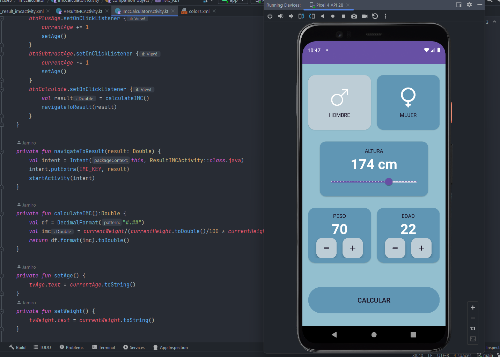
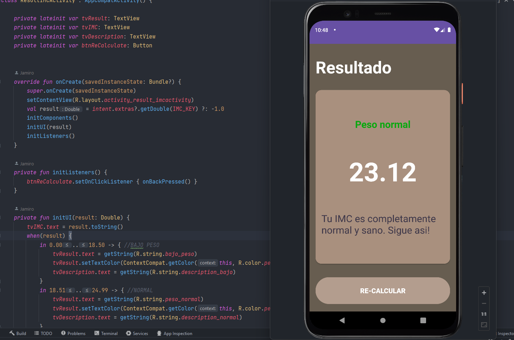

# Calculadora de IMC App

Esta es una aplicación simple para Android desarrollada utilizando Kotlin y XML en Android Studio. La aplicación permite a los usuarios calcular su Índice de Masa Corporal (IMC) y proporciona una clasificación de su peso basada en el IMC calculado.

## Características

- Calcular el IMC en función del peso, la altura y la edad del usuario.
- Mostrar el resultado del IMC junto con la clasificación del peso.
- Navegación sencilla entre diferentes pantallas mediante botones.

## Capturas de Pantalla

 

## Cómo Utilizar

1. Inicia la aplicación y te dará la bienvenida la pantalla principal.
2. Desde el menú principal, puedes elegir entre dos opciones:
   - **Hello App**: Navega a una pantalla simple con un mensaje de saludo.
   - **Calculadora de IMC**: Navega a la pantalla de la calculadora de IMC.
3. En la pantalla de la calculadora de IMC, puedes:
   - Seleccionar tu género (hombre o mujer) tocando la tarjeta correspondiente.
   - Ajustar tu peso usando los botones "+" y "-".
   - Ajustar tu edad usando los botones "+" y "-".
   - Ajustar tu altura utilizando el control deslizante.
   - Calcular tu IMC tocando el botón "Calcular".
4. Después de calcular, serás dirigido a la pantalla de resultados, que muestra tu IMC calculado, la clasificación de peso y una descripción breve.
5. Si deseas calcular nuevamente, simplemente toca el botón "Recalcular".

## Detalles Técnicos

La aplicación está construida utilizando la arquitectura Modelo-Vista-Controlador (MVC). Aquí tienes una descripción general de los componentes principales:

- **MenuActivity**: La pantalla principal del menú con dos botones, uno que lleva a la pantalla "Hello App" y otro a la pantalla "Calculadora de IMC".

- **ImcCalculatorActivity**: La pantalla de la calculadora de IMC donde los usuarios pueden seleccionar su género, ajustar peso, edad y altura, y calcular su IMC.

- **ResultIMCActivity**: La pantalla de resultados que muestra el IMC calculado, la clasificación de peso y una descripción.

## Requisitos Previos

- Android Studio
- Kotlin
- Android SDK

## Inicio Rápido

1. Clona este repositorio.
2. Abre el proyecto en Android Studio.
3. Compila y ejecuta la aplicación en un emulador de Android o dispositivo físico.

## Licencia

Este proyecto está bajo la [Licencia MIT](LICENSE).

